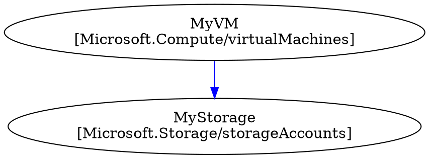
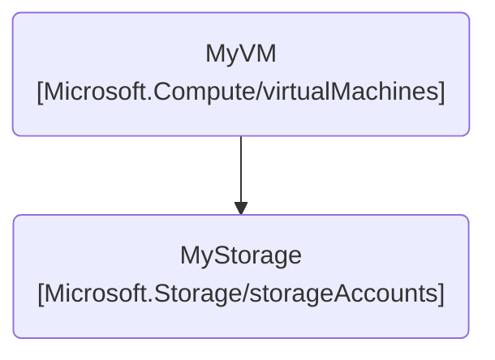

<picture>
  <source media="(prefers-color-scheme: dark)" srcset="./wetwire-dark.svg">
  
</picture>

The `wetwire-azure` command provides tools for generating and validating Azure ARM/Bicep templates from Go code.

## Quick Reference

| Command | Description |
|---------|-------------|
| `wetwire-azure build` | Generate ARM/Bicep template from Go source |
| `wetwire-azure lint` | Lint code for issues |
| `wetwire-azure init` | Initialize a new project |
| `wetwire-azure import` | Import ARM/Bicep template to Go code |
| `wetwire-azure design` | AI-assisted infrastructure design |
| `wetwire-azure test` | Run automated persona-based testing |
| `wetwire-azure validate` | Validate resources and references |
| `wetwire-azure list` | List discovered resources |
| `wetwire-azure graph` | Generate DOT/Mermaid dependency graph |

```bash
wetwire-azure --help     # Show help
```

---

## build

Generate Azure ARM or Bicep template from Go source files.

```bash
# Generate ARM JSON to stdout
wetwire-azure build ./infra > template.json

# Generate Bicep format
wetwire-azure build ./infra --format bicep > main.bicep

# Generate ARM template with output file
wetwire-azure build ./infra --output template.json
```

### Options

| Option | Description |
|--------|-------------|
| `PATH` | Directory containing Go source files |
| `--format, -f {json,bicep}` | Output format (default: json) |
| `--output, -o FILE` | Output file (default: stdout) |

### How It Works

1. Parses Go source files using `go/ast`
2. Discovers `var X = Type{...}` resource declarations
3. Extracts resource dependencies from field references
4. Orders resources topologically by dependencies
5. Generates ARM JSON or Bicep template

### Output Modes

**ARM JSON (default):**
```json
{
  "$schema": "https://schema.management.azure.com/schemas/2019-04-01/deploymentTemplate.json#",
  "contentVersion": "1.0.0.0",
  "resources": [
    {
      "type": "Microsoft.Storage/storageAccounts",
      "apiVersion": "2023-01-01",
      "name": "mystorageaccount",
      "location": "eastus",
      "sku": {
        "name": "Standard_LRS"
      }
    }
  ]
}
```

**Bicep:**
```bicep
resource mystorageaccount 'Microsoft.Storage/storageAccounts@2023-01-01' = {
  name: 'mystorageaccount'
  location: 'eastus'
  sku: {
    name: 'Standard_LRS'
  }
}
```

---

## lint

Lint wetwire-azure code for issues.

```bash
# Lint a directory
wetwire-azure lint ./infra

# Lint a single file
wetwire-azure lint ./infra/storage.go

# Lint with auto-fix
wetwire-azure lint ./infra --fix
```

### Options

| Option | Description |
|--------|-------------|
| `PATH` | File or directory to lint |
| `--fix` | Automatically fix issues where possible |
| `-f, --format {text,json}` | Output format (default: text) |

### What It Checks

1. **Resource discovery**: Validates resources can be parsed from source
2. **Reference validity**: Checks that referenced resources exist
3. **Type correctness**: Validates resource types are valid Azure types
4. **Pattern compliance**: Enforces wetwire declarative patterns
5. **Security**: Detects hardcoded secrets and credentials

### Output Examples

**Linting passed:**
```
Linting passed: 5 resources OK
```

**Issues found:**
```
./infra/storage.go:15: WAZ003: Extract inline property type to named variable
./infra/compute.go:23: WAZ005: Duplicate resource name: MyVM
```

### Lint Rules

See [LINT_RULES.md](LINT_RULES.md) for complete rule documentation.

| Rule | Description |
|------|-------------|
| WAZ001 | Use location constants for common regions |
| WAZ002 | Use intrinsic types for ARM template functions |
| WAZ003 | Extract inline property types to named variables |
| WAZ004 | Use typed structs instead of `map[string]any` |
| WAZ005 | Detect duplicate resource names |

---

## init

Initialize a new wetwire-azure project.

```bash
# Create a new project
wetwire-azure init myapp
```

### Arguments

| Argument | Description |
|----------|-------------|
| `project-name` | Name/path for the new project (required) |

### Generated Structure

```
myapp/
├── go.mod
├── main.go
├── .gitignore
└── infra/
    └── resources.go
```

**main.go:**
```go
package main

import (
    "fmt"

    _ "myapp/infra" // Register resources
)

func main() {
    fmt.Println("Run: wetwire-azure build ./infra")
}
```

**infra/resources.go:**
```go
package infra

import (
    "github.com/lex00/wetwire-azure-go/resources/storage"
    // ... other common imports
)

// Example storage account - uncomment and modify:
// var MyStorage = storage.StorageAccount{
//     Name:     "mystorageaccount",
//     Location: "eastus",
// }
```

---

## import

Import existing ARM template or Bicep file to Go code.

```bash
# Import ARM template
wetwire-azure import template.json -o ./my-infrastructure

# Import Bicep file
wetwire-azure import main.bicep -o ./my-infrastructure

# Import and apply lint fixes
wetwire-azure import template.json -o ./infra && wetwire-azure lint --fix ./infra
```

### Options

| Option | Description |
|--------|-------------|
| `PATH` | ARM JSON or Bicep file to import (required) |
| `-o, --output` | Output directory (default: `.`) |

### What Gets Imported

- Resources (all Azure types)
- Parameters
- Variables
- Outputs
- ARM template functions (converted to intrinsics)

### Post-Import Steps

1. Run `wetwire-azure lint --fix ./output` to apply automatic fixes
2. Review and manually fix remaining issues
3. Test with `wetwire-azure build ./output`

---

## validate

Validate resources and check dependencies.

```bash
wetwire-azure validate ./infra
wetwire-azure validate ./infra --format json
```

### Options

| Option | Description |
|--------|-------------|
| `PATH` | Directory containing Go source files |
| `--format, -f {text,json}` | Output format (default: text) |

### Checks Performed

- **Reference validity**: All resource references point to defined resources
- **Dependency graph**: Validates resource dependencies exist and are acyclic
- **Resource types**: Checks resource types are valid Azure types
- **Required properties**: Validates required properties are present

---

## list

List discovered resources in a package.

```bash
wetwire-azure list ./infra
```

### Output

```
Found 3 resources:
  MyStorage (Microsoft.Storage/storageAccounts)
  MyVM (Microsoft.Compute/virtualMachines)
  MyNIC (Microsoft.Network/networkInterfaces)
```

---

## graph

Generate a DOT or Mermaid format graph showing resource dependencies.

```bash
# Generate DOT format (default)
wetwire-azure graph ./infra

# Render with Graphviz
wetwire-azure graph ./infra | dot -Tpng -o deps.png

# Generate Mermaid format for GitHub markdown
wetwire-azure graph ./infra -f mermaid
```

### Options

| Option | Description |
|--------|-------------|
| `PATH` | Directory containing Go source files |
| `--format, -f {dot,mermaid}` | Output format (default: dot) |
| `--include-parameters, -p` | Include parameter nodes in the graph |

### Output Formats

**DOT (default):**

Graphviz DOT format for rendering with `dot`, `neato`, etc.



**Mermaid:**

GitHub-compatible format for embedding in markdown.



---

## design

AI-assisted infrastructure design. Starts an interactive session where you describe infrastructure in natural language and the AI generates wetwire-azure Go code.

**Providers:**
- `anthropic` (default) - Uses Anthropic API directly. Requires `ANTHROPIC_API_KEY`.
- `kiro` - Uses Kiro CLI with wetwire-runner agent.

```bash
# Start design session with a prompt
wetwire-azure design "Create a Linux VM with managed disk"

# Specify output directory
wetwire-azure design -o ./myproject "Create a storage account with blob container"

# Use Kiro provider
wetwire-azure design --provider kiro "Create a web app with App Service plan"
```

### Options

| Option | Description |
|--------|-------------|
| `prompt` | Natural language description of infrastructure (required) |
| `--provider` | AI provider: `anthropic` or `kiro` (default: `anthropic`) |
| `-o, --output` | Output directory (default: `.`) |
| `-l, --max-lint-cycles` | Maximum lint/fix cycles before giving up (default: 3) |
| `-s, --stream` | Stream AI responses to terminal (default: true) |

### How It Works

The `design` command uses the `wetwire-core-go` runner agent:

1. **Clarification**: AI asks questions about your requirements
2. **Code Generation**: Generates Go code using wetwire-azure patterns
3. **Lint Cycle**: Runs `wetwire-azure lint` and auto-fixes issues
4. **Build**: Runs `wetwire-azure build` to generate ARM template
5. **Validation**: Validates template structure

Press `Ctrl+C` to stop the session at any time.

---

## test

Run automated persona-based testing to evaluate AI code generation quality. Unlike `design`, this command uses an AI persona to simulate user responses.

**Requires:** `wetwire-core-go` and an Anthropic API key in `ANTHROPIC_API_KEY`.

```bash
# Run with default persona (intermediate)
wetwire-azure test "Create a virtual network with two subnets"

# Use a specific persona
wetwire-azure test --persona beginner "Create a storage account"

# Track test scenario
wetwire-azure test --scenario "vnet-basic" "Create VNet with NSG"
```

### Personas

| Persona | Description |
|---------|-------------|
| `beginner` | New to Azure, asks many clarifying questions |
| `intermediate` | Familiar with Azure basics (default) |
| `expert` | Deep Azure knowledge, asks advanced questions |

Custom personas can be registered for domain-specific testing.

### Options

| Option | Description |
|--------|-------------|
| `prompt` | Infrastructure description to test (required) |
| `-p, --persona` | Persona to use (default: `intermediate`) |
| `-S, --scenario` | Scenario name for tracking/reporting (default: `default`) |
| `-o, --output` | Output directory (default: `.`) |
| `-l, --max-lint-cycles` | Maximum lint/fix cycles (default: 3) |
| `-s, --stream` | Stream AI responses to terminal (default: false) |

---

## Typical Workflow

### Development

```bash
# Lint before generating
wetwire-azure lint ./infra

# Generate ARM template
wetwire-azure build ./infra > template.json

# Preview Bicep format
wetwire-azure build ./infra --format bicep
```

### CI/CD with Azure CLI

```bash
#!/bin/bash
# ci.sh

# Lint first
wetwire-azure lint ./infra || exit 1

# Generate ARM template
wetwire-azure build ./infra > template.json

# Deploy with Azure CLI
az deployment group create \
  --resource-group myResourceGroup \
  --template-file template.json
```

### CI/CD with Bicep

```bash
#!/bin/bash

# Generate Bicep
wetwire-azure build ./infra --format bicep > main.bicep

# Deploy Bicep
az deployment group create \
  --resource-group myResourceGroup \
  --template-file main.bicep
```

---

## Azure Template Functions (Intrinsics)

All Azure ARM template functions are supported via the intrinsics package:

| Function | Usage |
|----------|-------|
| `Concat` | `Concat([]any{"prefix-", ResourceGroup().Name})` |
| `ResourceGroup` | `ResourceGroup().Name`, `ResourceGroup().Location` |
| `Subscription` | `Subscription().Id`, `Subscription().SubscriptionId` |
| `ResourceId` | `ResourceId("Microsoft.Storage/storageAccounts", "myStorage")` |
| `Reference` | `Reference(MyStorage.Id).primaryEndpoints.blob` |
| `UniqueString` | `UniqueString(ResourceGroup().Id)` |
| `Parameters` | `Parameters("location")` |
| `Variables` | `Variables("storageAccountName")` |

**Note:** Use dot import for cleaner syntax: `import . "github.com/lex00/wetwire-azure-go/intrinsics"`

---

## Azure Regions

Common Azure region identifiers:

```go
// United States
"eastus", "eastus2", "westus", "westus2", "westus3"
"centralus", "northcentralus", "southcentralus"

// Europe
"northeurope", "westeurope", "uksouth", "ukwest"
"francecentral", "germanywestcentral"

// Asia Pacific
"eastasia", "southeastasia", "japaneast", "japanwest"
"australiaeast", "australiasoutheast"

// Use ResourceGroup().Location for dynamic location
Location: ResourceGroup().Location
```

---

## Dependencies

### wetwire-core-go

The `design` and `test` commands require [wetwire-core-go](https://github.com/lex00/wetwire-core-go), which provides:

- **Runner Agent**: Orchestrates the AI-driven code generation workflow
- **Personas**: Simulated user personas for automated testing
- **Session Tracking**: Records questions, responses, and results

Install via go.mod (already included as a dependency).

### Anthropic API

The `design` and `test` commands require an Anthropic API key:

```bash
export ANTHROPIC_API_KEY="sk-ant-..."
```

---

## See Also

- [Quick Start](QUICK_START.md) - Create your first project
- [FAQ](FAQ.md) - Common questions and answers
- [Lint Rules](LINT_RULES.md) - Complete lint rule reference
- [Wetwire Specification](https://github.com/lex00/wetwire/blob/main/docs/WETWIRE_SPEC.md) - Core philosophy
